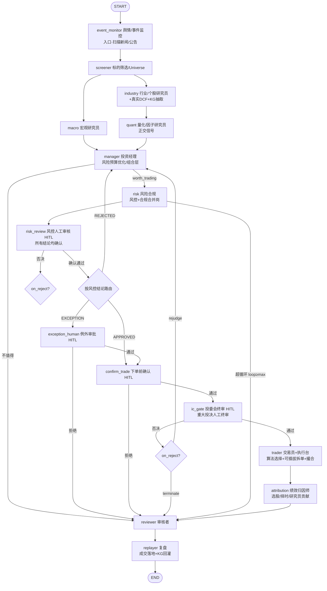

# 多 Agent 投研系统（LangGraph · A 股）

一个**离线可跑、可插拔、带人工审核（HITL）**的多智能体 A 股投研系统。它把真实投资公司的投研流程搬进一张状态机：**标的筛选 → 宏观/行业研究 → 投资经理（组合层）→ 风控（硬卡）→ 交易员（拆单）→ 审核者 → 复盘**，并配套**动态知识图谱（KG / GraphRAG）**、**工程化 Harness（校验/可观测/成本/注入防护）**、**回测与系统级评估**、**监控面板**与**调度钩子**。

> **设计哲学**
> - **离线优先**：默认用 `MockLLM` + `MockAshareProvider` + `LocalRunner`，无需任何 API key 即可端到端跑通、可验证。要接真实模型/数据，只需改 `config/settings.yaml`。
> - **可插拔核心业务**：下单策略、风控规则、数据层、LLM 层全部走「接口 + 注册表」模式，业务规则零改动调用方即可替换/扩展。
> - **确定性硬卡**：风控不依赖 LLM 拍板，硬约束一票否决；软约束超阈才进人工例外审批。
> - **双角色质量门**：开发者写码 + 审核者（`agents/reviewer.py` 内置节点 + `REVIEW_报告.md` 人工评审）双重把关业务正确性。
> - **双执行路径一致**：优先 LangGraph（支持 checkpointer / interrupt / 可视化）；环境无 LangGraph 时自动回退 `LocalRunner`，两者输出一致。

---

## 目录

- [1. 快速开始](#1-快速开始)
- [2. 整体架构](#2-整体架构)
- [3. 业务流程（状态机）](#3-业务流程状态机)
- [4. 模块详解](#4-模块详解)
- [5. 可插拔扩展指南](#5-可插拔扩展指南)
- [6. 配置说明（settings.yaml）](#6-配置说明settingsyaml)
- [7. 人工审核（HITL）与防死锁](#7-人工审核hitl与防死锁)
- [8. 运行产物（run_artifacts/）](#8-运行产物run_artifacts)
- [9. 测试](#9-测试)
- [10. 冲刺项进度](#10-冲刺项进度)
- [11. 免责声明](#11-免责声明)

---

## 1. 快速开始

```bash
cd multi_agent_research

# 安装依赖（pydantic / pyyaml 为离线必需；langgraph / langchain-openai 为真实模式可选）
pip install -r requirements.txt

# 默认 MockLLM + MockAshare，无需任何 API key 即可端到端跑通
python main.py

# 安静模式（不打印 trace）
python main.py -q

# 开启真人断点（仅在已安装 langgraph 时真正挂起等待真人；离线自动放行）
python main.py --hitl
```

切换到真实模型/数据：编辑 `config/settings.yaml`，把 `llm.provider` 改为 `openai`（并设置环境变量 `OPENAI_API_KEY`）、`data.provider` 改为 `tdx`（需接入 tdx-connector）。

跑测试：

```bash
pytest tests/          # 当前 108 个用例全绿
```

查看流程可视化：运行后打开 `run_artifacts/flow_dashboard.html`（交互式流程/状态机/架构图）。
业务质量评审见 `REVIEW_报告.md`。

---

## 2. 整体架构

系统由四层组成，自上而下解耦：

```
┌──────────────────────────────────────────────────────────────────────┐
│                          main.py  (编排入口)                           │
│   组装 AppContext → 构造 Scheduler → build_app(ctx) → 运行 → 后处理     │
└──────────────────────────────────────────────────────────────────────┘
                                   │
                                   ▼
┌──────────────────────────────────────────────────────────────────────┐
│                   graph/builder.py  (状态机编排层)                      │
│   build_app(ctx)：优先 LangGraph StateGraph，否则 LocalRunner 回退      │
│   节点：event_monitor / screener / macro / industry / quant / manager /│
│         risk(风险合规) / risk_review / exception_human / confirm_trade /│
│         ic_gate / trader(交易员+执行台) / attribution / reviewer /      │
│         replayer                                                          │
└──────────────────────────────────────────────────────────────────────┘
                                   │
        ┌──────────────────────────┼──────────────────────────┐
        ▼                          ▼                          ▼
┌──────────────┐          ┌──────────────────┐      ┌──────────────────────┐
│  agents/*    │          │  portfolio/risk/  │      │     harness/*        │
│ 研究/投决/   │          │  strategies/      │      │  校验/提示库/可观测/  │
│ 风控/交易/   │          │  可插拔业务规则   │      │  成本护栏/注入防护/HITL│
│ 审核/复盘    │          │                  │      │                      │
└──────────────┘          └──────────────────┘      └──────────────────────┘
        │                          │                          │
        └──────────────┬───────────┴───────────┬──────────────┘
                       ▼                       ▼
              ┌────────────────┐       ┌────────────────────────┐
              │ data/ + kg/    │       │ core/ (config/context/  │
              │ 数据层 + 动态   │       │        llm/checkpointer)│
              │ 知识图谱GraphRAG│       │ AppContext 依赖容器     │
              └────────────────┘       └────────────────────────┘
```

### 2.1 依赖注入容器：`AppContext`

所有节点都是 **`run(state, ctx) -> 部分更新字典`** 的形态。节点**不直接 `new` 依赖**，而是从 `AppContext` 取用 LLM / 数据 / 风控引擎 / 策略 / 知识图谱 / Harness 组件。这带来两点好处：

- 易于离线替换：Mock 与真实实现只差 `ctx` 的构造，节点代码不变。
- 易于测试：`main._build_context()` 同时被端到端测试和 `main` 复用，避免 ctx 构造逻辑腐烂。

详见 `core/context.py`。

### 2.2 双执行路径：`build_app(ctx)`

```python
def build_app(ctx):
    if _HAS_LANGGRAPH:
        return build_graph(ctx).compile(checkpointer=build_checkpointer("memory"))
    return LocalRunner(ctx)
```

- **LangGraph 版**：`StateGraph(ResearchState)` 显式声明节点与条件边，支持 checkpointer、`interrupt()` 真人断点、可视化。
- **LocalRunner 版（离线回退）**：用同一套节点函数复刻流转。`_merge()` 模拟 LangGraph 的 reducer 语义——列表字段（`log/audit_log/analyst_reports/fills`）累加、字典字段（`kg_stats/monitor`）合并、其余覆盖。保证无 langgraph 依赖也能端到端运行与验证。

> 容器状态用 `state/schemas.py` 的 `ResearchState`（TypedDict + `Annotated[...]` reducer），与 LangGraph 多层流转语义一致。

### 2.3 节点更新语义

每个节点返回一个**部分 state 更新字典**（partial update），由编排层并入全局 state。LangGraph 用原生 reducer；`LocalRunner` 用 `_merge` 等价实现。所有跨角色传递物都通过 Pydantic 严格 Schema（`state/schemas.py`），这是 Harness 校验的**第一道防线**。

---

## 3. 业务流程（状态机）



文字版：

```
START → 舆情/事件监控(入口) → 标的筛选(Universe) →[并行] 宏观 & 行业 → 量化(正交信号) → 投资经理(组合层)
   ├─ 不值得交易 → 审核者 → 复盘 → END
   └─ 值得交易 → 风险合规(风控+合规合并岗)
        └─ 风控结论 → 风控人工审核(HITL，所有结论均确认)
             ├─ 否决(terminate) → 审核者 → 复盘 → END
             ├─ 否决(rejudge)   → 带反馈回落投资经理(loop_count++，防死锁)
             └─ 确认通过 → 按风控结论流转：
                  ├─ APPROVED  → 下单前确认(HITL) → 投委会终审(HITL，重大投决)
                  ├─ EXCEPTION → 例外审批(HITL) → 通过则下单前确认 / 拒绝则审核者
                  └─ REJECTED  → 回落投资经理(loop_count++)，超循环则强制终结
        投委会终审通过 → 交易员(算法执行台+可插拔拆单+撮合) → 绩效归因师 → 审核者 → 复盘(成交落地+KG回灌) → END
```

---

## 4. 模块详解

| 目录 | 职责 | 关键文件 |
|------|------|----------|
| `state/` | 全局状态与产物 Schema（Pydantic 严格定义，Harness 第一道防线）；`ResearchState` 容器类型 | `schemas.py` |
| `core/` | LLM/数据抽象、`Settings` 配置、`AppContext` 依赖容器、checkpointer | `config.py` `context.py` `llm.py` `checkpointer.py` |
| `data/` | 数据层抽象（A 股专属）；`MockAshareProvider` 离线确定性数据；`TdxProvider` 真实接入桩；A 股规则事实层 | `provider.py` `ashare_rules.py` |
| `strategies/` | 可插拔下单策略（Market/TWAP/VWAP）+ 注册表 | `base.py` `registry.py` `twap.py` `vwap.py` `market.py` |
| `risk/` | 可插拔风控引擎（硬约束+软约束规则注册表）+ 合规引擎（合规检查注册表，与风控合并为同一岗位） | `engine.py` `compliance.py` `rules/base.py` + `rules/hard_*` `rules/soft_*` |
| `agents/` | 多角色节点（研究/投决/风险合规/量化/事件/交易执行/归因/审核/复盘） | `screener` `macro` `industry` `manager` `risk_controller`(风险合规) `quant` `event_monitor` `trader`(交易员+执行台) `attribution` `reviewer` `replayer` |
| `kg/` | 动态知识图谱：schema、存储、抽取、GraphRAG 检索、增量更新 | `schema.py` `store.py` `extractor.py` `retrieval.py` `updater.py` |
| `harness/` | 工程化五件套 + HITL | `datavalidator` `prompthub` `observability` `cost_guard` `injection_guard` `hitl` `traced_llm` |
| `research/` | DCF 估值适配器（封装 `tools/dcf_implied.py` 真实反算） | `dcf.py` `tools/dcf_implied.py` |
| `portfolio/` | 组合层风险预算优化（目标权重 / 调仓 diff） | `optimizer.py` |
| `backtest/` | PaperTrader 模拟撮合 + 回测引擎 | `paper_trader.py` `engine.py` |
| `eval/` | 系统级评估（策略 vs 等权基准） | `evaluator.py` `performance.py` |
| `monitor/` | 运行监控面板（JSON + HTML） | `monitor.py` |
| `scheduler/` | 调度钩子实体化（盘前/收盘/周度/事件） | `scheduler.py` `jobs.py` |
| `graph/` | 状态机编排（LangGraph + LocalRunner 回退） | `builder.py` |
| `main.py` | 端到端 Demo 编排 | — |
| `tests/` | 108 个单元测试 / 集成 / 端到端 | — |

### 4.1 状态与 Schema（`state/schemas.py`）

所有角色间的传递物（报告、决策、风控结论、订单、成交回报）都用 Pydantic 严格定义，内建 A 股语义（板块 `BoardType`、涨跌停、T+1、评级、买卖方向）。关键产出：

- `AnalystReport`：个股研究（含 `dcf_implied_L` 市场隐含终局利润、`dcf_fair_price` DCF 合理价、`data_quality_ok` 红线标记）。
- `ManagerDecision`：投决（含 `rebalance_orders` 调仓指令集、`target_portfolio_weights` 风险预算目标权重）。
- `RiskCheckResult`：风控结论（`APPROVED` / `REJECTED` / `EXCEPTION` + 硬违规 + 软发现 + 反馈）。
- `ExecutionPlan` / `TradeFill`：拆单计划与成交回报。
- `Portfolio` / `Holding`：组合与持仓（自动算市值/净值/行业敞口/个股权重）。
- `AuditEntry`：审计留痕（每个关键节点写入 `audit_log`）。

### 4.2 数据层与 A 股规则（`data/`）

- `BaseDataProvider` 统一接口（`get_quote` / `get_fundamentals` / `get_macro` / `get_adv` / `get_news`）。
- `MockAshareProvider`：离线确定性数据，内置茅台/平安银行/宁德时代示例标的，DCF 反算所需三年一致预期净利润由 TTM 逐年 +8% 模拟。
- `TdxProvider`：tdx-connector 接入桩，接口已对齐，待接真实 MCP。
- `ashare_rules.py`：**交易所规则事实层**（不可配置）——主板 ±10%、双创（300/688）±20%、ST ±5% 且禁投、T+1 当日不可卖、禁裸卖空。被风控硬约束与审核者双重使用。

### 4.3 可插拔业务（策略 / 风控）

- **下单策略**（`strategies/`）：`OrderStrategy` 抽象 + `registry.get_strategy(name)`。已实现 `Market` / `TWAP` / `VWAP`。新增策略 = 新文件继承 `OrderStrategy` 并 `@register_strategy`，trader 零改动。
- **风控引擎**（`risk/`）：`RiskEngine` 聚合 `hard_*`（一票否决 → `REJECTED`）与 `soft_*`（超阈 → `EXCEPTION` 需人工）。新增规则 = 实现 `RiskRule.check()` 并 `register`。当前硬约束：单票/行业/总仓位、ADV 流动性、止损、A 股市场规则；软约束：1 日 95% VaR、叙事脆弱性。
- **合规引擎**（`risk/compliance.py`）：`ComplianceEngine` 聚合 `ComplianceCheck`（HARD：`RestrictedListCheck` 禁投名单+ST、`InsiderSilentPeriodCheck` 内幕静默期；SOFT：`Disclosure5pctCheck` 5% 举牌披露、`FairTradeCheck` 公平交易）。与风控合并为同一岗位——`risk_controller` 同时跑两者，HARD 违规并入 `hard_violations` 并升级为 `REJECTED`，结果单独留痕。

### 4.4 角色节点（`agents/`）

> 角色体系演进：原「研究员 / 基金经理 / 风控 / 交易员」四岗，现已扩展为「9 节点、8 个职能角色」——**风控与合规合并**为同一岗位；**投委会 / 终审委员（IC Gate）**作为人工终审 HITL 环节；新增**量化/因子研究员**、**舆情/事件监控员**、**绩效归因师**；**算法交易/执行优化（Execution Desk）合并进交易员**（Agent 不落地真实交易，执行台只负责算法选择与可插拔拆单）。

- **event_monitor（舆情/事件监控员，入口）**：在流程最前端扫描 `watchlist` 新闻/公告，按负面词与重大词标记 `MarketEvent`（`material` 事件才触发调度重研），为后续研究提供事件上下文。
- **screener**：从 `watchlist` 生成 Universe（真实可接事件/扫描）。
- **macro**：输出走势研判与仓位上限建议，并写宏观因子实体到 KG。
- **industry**：穿透叙事分析 + **真实 DCF 反算目标价/评级** + DataValidator 红线校验 + 新闻注入清洗后抽取三元组写 KG。
- **quant（量化/因子研究员，正交信号）**：基于行情确定性计算动量/波动率/流动性/因子分，给出 `BULLISH/NEUTRAL/BEARISH` 正交观点，**仅作投资经理的参考输入，不改其目标权重**。
- **manager**：聚合宏观/行业/KG/量化上下文，用 `portfolio.optimizer` 做**风险预算优化**（宏观上限 × 行业景气 × 评级置信度），与当前持仓 diff 出买/卖指令，统一 `clamp_targets` 封顶防破硬约束。
- **risk_controller（风险合规合并岗）**：调用 `RiskEngine` 做确定性硬卡（不靠 LLM）；**同时调用 `ComplianceEngine` 做合规检查**（禁投名单/ST 禁投、内幕信息静默期、5% 举牌披露、公平交易）。合规 HARD 违规并入 `hard_violations` 并升级为 `REJECTED`，合规结果单独留痕供审计。
- **trader（交易员 + 执行台）**：取可插拔策略拆单，按名义规模/ADV 自动选 VWAP（大额或低流动性）或 TWAP，用 `PaperTrader` 模拟撮合（冲击成本 ∝ 名义/ADV），产出成交回报与 `execution_memo`。
- **attribution（绩效归因师）**：基于成交回报做选股贡献（成交价 vs 分析师目标价）、择时/滑点成本、研究员维度贡献归因，输出 `AttributionReport`。
- **reviewer**：内置业务质量审计（风控是否真硬卡、组合层是否覆盖、A 股规则是否落地、循环是否防死锁、新增角色是否各自履职），写 `audit_log`。
- **replayer**：成交落地到组合（更新现金/持仓）+ 复盘回灌 KG 置信度（预测目标价 vs 实际价）。

### 4.5 动态知识图谱（KG / GraphRAG，`kg/`）

- **schema**：实体（Company/Industry/Concept/Macro/Event/Person/Price）+ 关系（BELONGS_TO/PEER_OF/RATED/HAS_TARGET/RELATED_CONCEPT/DRIVEN_BY/EVENT_AFFECTS/SUPPLIES），ID 规范化便于实体对齐，带 `confidence`/`sources`。
- **store**：内存（实体字典 + 邻接表）+ sqlite 持久化（`save/load_sqlite`）；关系写入自动补齐占位端点；置信度 noisy-OR 融合。
- **extractor**：结构化报告确定性映射三元组；非结构化文本支持 LLM 抽取（真实环境）与启发式兜底（离线）。
- **retrieval**：GraphRAG 子图遍历 + 相关性/置信度混合打分，`to_context(ticker)` 输出投资经理可用的「机构记忆」上下文（同行/概念/宏观驱动/事件/目标价）。
- **updater**：增量写回、`decay()` 时间衰减（半衰期可配）、`update_outcome()` 复盘回灌上调/下调 HAS_TARGET 置信度。

### 4.6 工程化 Harness（`harness/`）

- **DataValidator**：跨角色数据质量红线（PE 异常、单位错配、DCF 一致性、评级-目标价一致性）。
- **PromptHub**：角色 system prompt 版本化管理（支持多版本/回滚）。
- **observability**：`Tracer`（JSON 行 trace）+ `Metrics`（计数器/计时）。
- **cost_guard**：LLM token/费用估算 + 预算护栏（`BudgetExceeded`）。
- **injection_guard**：外部文本入 LLM/KG 前的提示注入/数据投毒检测与中性化（保留可审计）。
- **hitl**：`human_approve()` 人工断点，优先 LangGraph `interrupt()`，离线/无人值守自动放行。
- **traced_llm**：包装任意 `BaseLLM`，自动织入成本计量与链路追踪（装饰器模式）。

### 4.7 回测 / 评估 / 监控 / 调度

- **backtest**：`PaperTrader` 逐段撮合（冲击成本 ∝ 名义/ADV，卖出叠加卖压）；`BacktestEngine` 复现权益曲线（真实环境替换为历史 K 线）。
- **eval**：系统级评估——策略 vs 等权买入持有基准，输出超额收益/夏普/最大回撤/胜率。
- **monitor**：把一轮运行汇总为 `monitor.json` + 单文件 `monitor.html` 仪表盘。
- **scheduler**：钩子实体化——`post_market`（写 KG sqlite + 运行台账 + 推送）、`pre_market`（盘前关注清单，涨跌停/ST 标记）、`weekly`（KG 置信度衰减 + 周报）、`event`（重大事件即时推送 + 触发重研）。`ScheduleSpec` 进程内定时、`last_fired` 持久化去重、`PushSink` 可插拔（控制台/文件/Webhook）。

---

## 5. 可插拔扩展指南

### 5.1 新增一条下单策略

```python
# strategies/my_strategy.py
from state.schemas import ExecutionPlan, OrderLeg, StrategyType
from strategies.base import OrderStrategy, StrategyContext
from strategies.registry import register_strategy

@register_strategy
class MyStrategy(OrderStrategy):
    strategy_type = StrategyType("MY")   # 注册名
    label = "我的策略"

    def build(self, legs: List[OrderLeg], ctx: StrategyContext) -> ExecutionPlan:
        # 实现拆单逻辑，返回 ExecutionPlan
        ...
```

然后在 `strategies/registry.py` 追加一行 `from strategies.my_strategy import MyStrategy`，并在 `settings.yaml` 把 `default_strategy` 改为 `MY`。

### 5.2 新增一条风控规则

```python
# risk/rules/hard_myrule.py
from risk.rules.base import RiskRule, RiskContext, RuleResult

class MyRule(RiskRule):
    name = "my_rule"
    severity = "HARD"   # 或 "SOFT"

    def check(self, ctx: RiskContext) -> RuleResult:
        violated = ...   # 你的判定
        return RuleResult(rule=self.name, severity=self.severity,
                          violated=violated, message="...",
                          metric=...)  # SOFT 才需要 metric
```

在 `risk/engine.py` 的 `_register_defaults()` 中 `from risk.rules.hard_myrule import MyRule` 并 `self.register(MyRule())`。

### 5.3 接入真实 LLM / 数据

- LLM：把 `settings.yaml` 的 `llm.provider` 设为 `openai`，并设置环境变量 `OPENAI_API_KEY`（见 `core/llm.py` 的 `OpenAILLM`）。
- 数据：实现 `BaseDataProvider` 的具体类（如接 tdx-connector / wind / 聚源），在 `data/provider.py` 的 `get_provider()` 中按 `settings.data.provider` 返回。

---

## 6. 配置说明（settings.yaml）

| 配置项 | 含义 |
|--------|------|
| `market` | 固定 `A_SHARE`（仅 A 股） |
| `llm.provider` | `mock`（离线）\| `openai`（真实） |
| `llm.model` / `temperature` / `api_key_env` / `base_url` | 真实模型参数 |
| `data.provider` | `mock`（离线）\| `tdx`（待接入） |
| `max_loop` | 风控循环最大次数（**防死锁**：`REJECTED` 时 `loop_count++`，≥ 上限强制终结） |
| `default_strategy` | 默认下单策略（注册表名，如 `TWAP`/`VWAP`/`MARKET`） |
| `hitl_enabled` | 是否启用人工 HITL 检查点（`--hitl` 会强制开启） |
| `risk_review.on_reject` | 风控人工审核**否决**后的去向：`rejudge`（回落投资经理重研判）\| `terminate`（直接终结进审核者） |
| `initial_cash` / `initial_holdings` | 初始组合 |
| `risk_limits.*` | 风险限额（单票/行业/总仓位上限、ADV 流动性比例、止损、VaR、禁 ST、禁裸卖空等） |
| `watchlist` | 观察标的池（Universe 入口） |
| `kg_decay_half_life` | KG 置信度周度衰减半衰期（天） |
| `scheduler.*` | 盘前/收盘/周度钩子定时规格（hour/minute/weekdays） |
| `compliance.*` | 合规配置：`restricted_list`（禁投名单）、`silent_period`（内幕信息静默期） |
| `ic_gate.*` | 投委会终审：`on_reject`（deny 后 `rejudge` 回落重研 / `terminate` 终结）、`materiality`（单票权重阈值 5% / 调仓总偏离阈值 10% / 例外是否重大） |
| `quant.*` | 量化配置：`enabled`、`momentum_window`、`neutral_band` |
| `event_monitor.*` | 事件监控配置：`enabled`、`negative_keywords`、`material_keywords` |
| `attribution.*` | 绩效归因配置：`enabled` |
| `execution_desk.*` | 执行台配置：`default_strategy`、`large_notional`（大额阈值）、`low_adv_ratio`（低流动性切换阈值） |

---

## 7. 人工审核（HITL）与防死锁

系统在四处设置人工断点（由 `harness.hitl.human_approve` 提供）：

1. **风控人工审核 `risk_review`**：对**所有**风控结论（APPROVED/REJECTED/EXCEPTION）做人工确认。确认通过 → 按原结论流转；否决 → 按 `risk_review.on_reject` 决定 `terminate`（终结进审核者）或 `rejudge`（回落投资经理重研判，`loop_count++`）。
2. **例外审批 `exception_human`**：软约束触发 EXCEPTION 时需人工放行/拒绝。
3. **下单前确认 `confirm_trade`**：通过风控后、正式下单前的人工确认。
4. **投委会终审 `ic_gate`**：`confirm_trade` 通过后进入。先按 `ic_gate.materiality` 判定是否「重大投决」（单票目标权重 > 5%、调仓总偏离 > 10%、或风控例外且 `exception_is_material=True`）；**不重大 → 系统自动放行**（actor=system, action=auto_pass）；**重大 → 挂真人终审**，通过则进入交易执行，否决则按 `ic_gate.on_reject` 决定 `terminate`（终结进审核者）或 `rejudge`（回落投资经理重研判，`loop_count++`）。

> 无人值守/离线 Demo（`hitl_enabled=False`）自动放行；`--hitl` + 已装 langgraph 时 `interrupt()` 真正挂起等待真人，`main._run_app` 用 `Command(resume=...)` 逐断点 resume。

**防死锁**：`REJECTED` 或 IC Gate 否决 `rejudge` 回落会 `loop_count++`；当 `loop_count >= max_loop`（默认 3）时，无论风控还是人工否决重研，一律强制路由到 `reviewer` 终结，避免无限循环。

---

## 8. 运行产物（run_artifacts/）

每次运行在 `run_artifacts/` 落盘：

| 文件 | 说明 |
|------|------|
| `kg.sqlite` | 知识图谱持久化（实体/关系） |
| `monitor.html` / `monitor.json` | 运行监控仪表盘 |
| `schedule_runs.json` | 收盘后运行台账（调度「写库」代理） |
| `push_log.jsonl` | 推送通道日志（控制台+文件） |
| `pre_market_*.json` | 盘前关注清单（涨跌停/ST 标记） |
| `weekly_*.json` | 周度复盘（KG 置信度衰减后快照） |
| `scheduler_state.json` | 调度状态持久化（last_fired / 重研队列） |
| `trace.jsonl` | 链路追踪日志 |

> `flow_dashboard.html` 为交互式流程可视化页（流程/状态机/调度层/KG/双角色/架构图 + 免责声明落款），读取最近一次运行产物。

---

## 9. 测试

```bash
pytest tests/
```

覆盖：A 股规则、风控规则、拆单策略、DCF、组合优化、KG 集成/端到端、回测、Harness、调度、状态机、风控人工审核（10 例，含确认放行/否决-rejudge 回落+loop_count++/否决-terminate 终结/超循环防死锁/默认自动放行/LocalRunner 全链路）、**合规引擎**、**量化因子信号**、**事件监控**、**绩效归因**、**投委会终审（IC Gate）重大性判定与 HITL 路由**、**执行台算法选择**、全流程多角色集成。当前 **108 个用例全部通过**。

---

## 10. 冲刺项进度

| 编号 | 内容 | 状态 |
|------|------|------|
| P0–P6 | 脚手架 → 研究/投决/风控循环/交易/复盘 → 动态 KG/GraphRAG → Harness 工程化 → 回测/评估/监控/调度 | ✅ 已完成 |
| ① 真实 DCF 接入 | `research/dcf.py` 封装 `tools/dcf_implied.py`，行业研究员真实反算 `dcf_implied_L` / `dcf_fair_price`，评级由上行空间推导 | ✅ |
| ② 组合层风险预算优化 | `portfolio/optimizer.py`：宏观上限 × 行业景气 × 评级置信度，与持仓 diff 出买/卖指令 | ✅ |
| ③ 固定免责声明落款 | 流程页已加；monitor.html 页脚待补 | 🟡 部分 |
| ④ Neo4j 迁移 | 替换 `kg/store.py` 纯标准库实现 | ⬜ 待做 |
| ⑤ 调度钩子实体化 | `scheduler/`：post_market 真实写库/推送 + pre_market/weekly 定时 + 重大事件触发重研 | ✅ |
| ⑥ 更丰富图集成测试 | `tests/test_kg_integration.py` + `tests/test_kg_e2e.py`（发现并修复 `load_sqlite` 实体 key 错用 JSON 字符串的真实 bug） | ✅ |
| ⑦ 风控阶段人工审核确认 HITL | `risk` 后插 `risk_review` 节点，对所有风控结论人工确认；否决按 `settings.risk_review.on_reject` 路由，含超循环防死锁 | ✅ |
| ⑧ 风控 + 合规合并岗 | 新增 `risk/compliance.py`（`ComplianceEngine` + 可插拔 `ComplianceCheck`：禁投名单/ST、`InsiderSilentPeriod`、5% 举牌披露、公平交易）；`risk_controller` 同时跑风控与合规，HARD 违规升级 `REJECTED` 并留痕 | ✅ |
| ⑨ 投委会终审（IC Gate）HITL | 新增 `ic_gate` 节点：重大性判定（单票权重/调仓偏离/例外）→ 重大挂真人终审、不重大自动放行；否决按 `ic_gate.on_reject` 路由，含超循环防死锁 | ✅ |
| ⑩ 量化/因子研究员 | 新增 `agents/quant.py`：动量/波动率/流动性/因子分 → `BULLISH/NEUTRAL/BEARISH` 正交信号，仅作投决参考 | ✅ |
| ⑪ 舆情/事件监控员 | 新增 `agents/event_monitor.py`：扫描新闻/公告，标记负面/重大 `MarketEvent`，重大事件驱动调度重研 | ✅ |
| ⑫ 绩效归因师 | 新增 `agents/attribution.py`：选股贡献 + 择时/滑点成本 + 研究员维度贡献归因 | ✅ |
| ⑬ 算法交易/执行台合并进交易员 | `agents/trader.py` 新增算法选择（大额/低流动性→VWAP，否则 TWAP）+ `execution_memo`，Agent 不落地真实交易 | ✅ |

---

## 11. 免责声明

本项目为**研究/教学用途的多智能体投研系统原型**，全部运行于离线 Mock 数据与 Mock 模型环境，**不构成任何投资建议**。所有评级、目标价、调仓指令均为系统逻辑演示产物，实盘使用前须接入经合规校验的真实数据源与模型，并接受独立风控与合规审查。

---

## 双角色开发约定

- **开发者**：实现/修改 `agents/`、`risk/`、`strategies/`、`kg/` 等核心代码，保持「业务可插拔、A 股规则落地、风控硬卡、循环防死锁」。
- **审核者**：`agents/reviewer.py` 在每次运行内置业务质量审计并写入 `audit_log`；独立的人工评审见 `REVIEW_报告.md`（由审核者角色出具，覆盖 P0–P6 的业务正确性逐条核验）。
