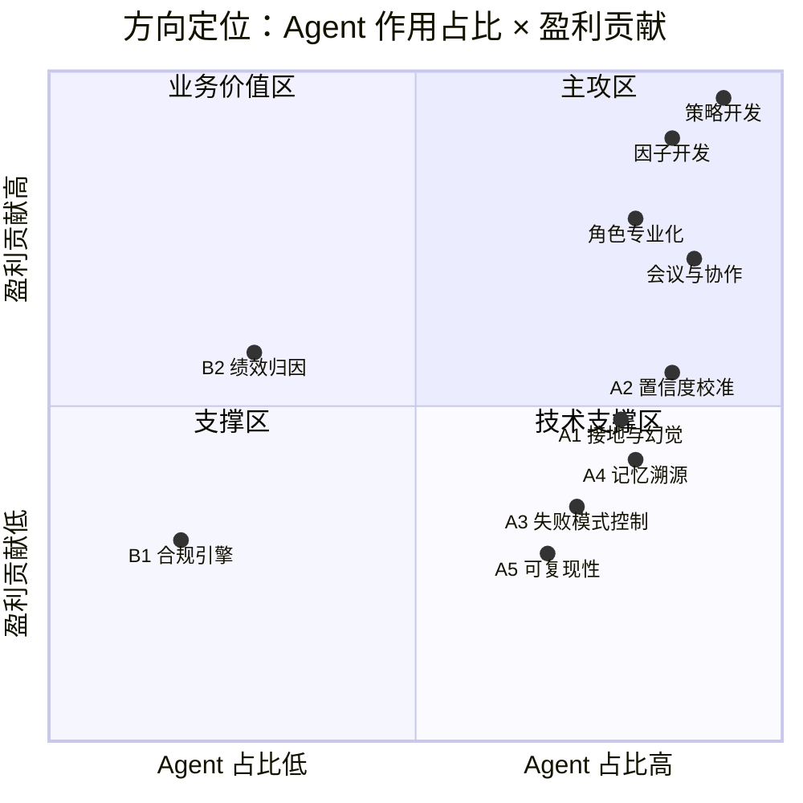
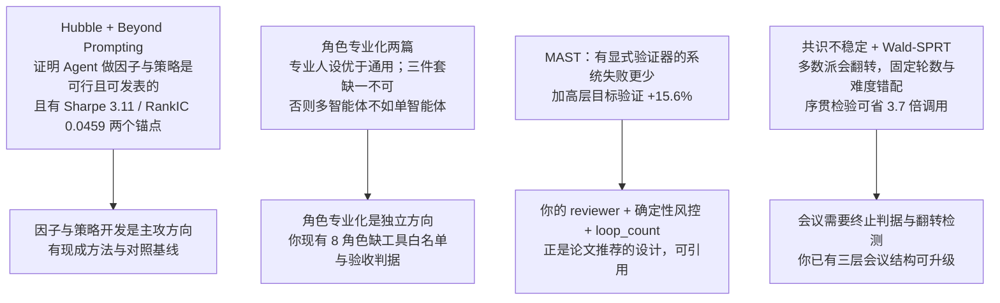
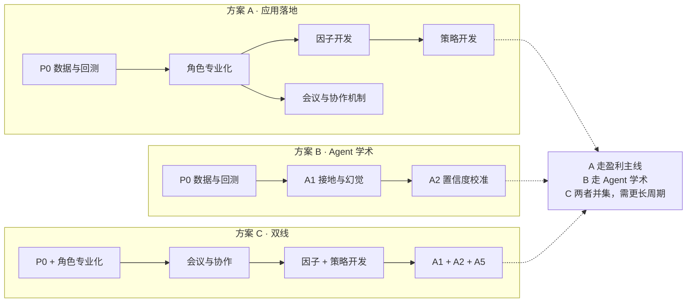

# 金融 Agent 开源比对 · 论文依据 · 方向建议

> 2026-09-13 ｜ GitHub 与 arXiv 实测
>
> 核心判断：**策略与因子是盈利来源，也是 Agent 最能发挥价值的地方。** 合规、归因、数据回测是支撑与前提，不是主攻方向。

---

# 一、开源项目比对

## 1.1 主线项目

| 项目                                |   Star | 值得看的原因                                           |
| --------------------------------- | -----: | ------------------------------------------------ |
| HKUDS/Vibe-Trading                |  33.3k | 唯一做到个人交易全闭环：多券商接入、审计、策略发现带证据门、462 个因子池           |
| ginlix-ai/LangAlpha               |   1.7k | Agent 工程技术最完整：程序化工具调用、记忆分层、上下文治理                 |
| TauricResearch/TradingAgents      | 104.9k | 多智能体辩论范式源头，有配套论文                                 |
| simonlin1212/TradingAgents-astock |   3.3k | 唯一把 A股制度与特有信息源做进分析师角色的实现                         |
| xbtlin/ai-berkshire               |  16.3k | 投研方法论结构化最系统，含三票制交叉验证                             |
| QuantaAlpha                       |   1.5k | 唯一公开可引用的因子评测口径（CSI300 IC 0.0472 / RankIC 0.0459） |

## 1.2 能力横向比对

| 能力        | Vibe-Trading | LangAlpha | TradingAgents |  astock | ai-berkshire | QuantaAlpha |   **我的项目**  |
| --------- | :----------: | :-------: | :-----------: | :-----: | :----------: | :---------: | :---------: |
| **因子开发**  | ⚠️ 454 个现成因子 |     ❌     |       ❌       |    ❌    |       ❌      |   ✅ 自进化挖掘   |      ❌      |
| **策略开发**  | ✅ 策略发现 + 证据门 |     ❌     |    ⚠️ 单次决策    | ⚠️ 单次决策 |       ❌      |    ⚠️ 因子层   | ⚠️ 有拆单无策略生成 |
| **角色专业化** |    ⚠️ 委员会制   |   ⚠️ 通用   |    ✅ 4 分析师    | ✅ 7 分析师 |   ✅ 4 大师视角   |    ⚠️ 单角色   |  ✅ 8 职能但缺约束 |
| 多步自主研究    |       ✅      |     ✅     |       ✅       |    ✅    |       ✅      |      ✅      |      ⚠️     |
| 确定性风控     |      ⚠️      |     ❌     |       ❌       |    ❌    |       ❌      |      ❌      |      ✅      |
| 合规检查      |       ❌      |     ❌     |       ❌       |    ❌    |       ❌      |      ❌      |      ✅      |
| 交易执行      |       ✅      |     ⚠️    |       ❌       |    ❌    |       ❌      |      ❌      |      ⚠️     |
| 记忆机制      |       ✅      |     ✅     |       ⚠️      |    ⚠️   |       ❌      |      ⚠️     |      ✅      |
| 回测 / 验证   |       ✅      |     ❌     |       ❌       |    ❌    |       ❌      |      ✅      |      ⚠️     |
| 数值接地校验    |       ✅      |     ❌     |       ❌       |    ❌    |       ❌      |      ❌      |      ❌      |
| 决策置信度输出   |       ❌      |     ❌     |       ❌       |    ❌    |       ❌      |      ❌      |      ❌      |

> 前两行是**决定盈利的格子**，全场只有 QuantaAlpha 与 Vibe-Trading 各占一半；最后一行全场空白。

## 1.3 值得借鉴的模块（粗粒度）

| 模块           | 出处                                    | 借鉴什么                                   |
| ------------ | ------------------------------------- | -------------------------------------- |
| **因子挖掘闭环**   | QuantaAlpha                           | LLM 引导搜索 + 演化反馈 + 严格的样本外与多重检验口径        |
| **策略发现与证据门** | Vibe-Trading                          | 策略迭代必须产出可自证的证据，无证据不得进入下一步（fail-closed） |
| **角色专业化范式**  | TradingAgents + astock + ai-berkshire | 辩论范式 / A股特有角色 / 大师视角与三票制交叉验证           |
| **上下文工程**    | LangAlpha                             | Agent 写代码在沙箱取数 + 工具只载摘要 + 大结果卸载 + 超限压缩 |
| **记忆分层**     | LangAlpha                             | 工作区笔记 / 用户偏好 / 跨工作区知识 / 用户材料           |
| **审计与验证**    | Vibe-Trading                          | 哈希链审计账本 + 版本 manifest + 防前视回测协议        |

---

# 二、我的项目诊断

## 2.1 已有资产（开源无对手）

| 资产                                  | 开源对比               |
| ----------------------------------- | ------------------ |
| 双执行路径（LangGraph + LocalRunner，输出一致） | 全场唯一，无框架也能端到端跑     |
| Pydantic Schema 作为防线                | 全场唯一把 Schema 当第一道闸 |
| 显式状态机 + loop_count 防死锁              | 开源多为自由 ReAct，可控性差  |
| HITL 四断点 + 离线自动放行                   | 全场唯一兼顾真人与 CI 可测    |
| 确定性风控与合规内核                          | 全场唯一，纯函数不依赖 LLM    |
| 风险预算优化器 + 拆单策略注册表                   | 开源无可比模块            |

**可合成技术主张：「确定性优先的 Agent 编排」**——用显式状态机约束 LLM 自由度，把不可控的部分关进 Schema 与规则里。第三章论文会说明这条路是对的。

## 2.2 差距

| 能力         | 现状                                 | 参照                                                  |
| ---------- | ---------------------------------- | --------------------------------------------------- |
| **因子开发**   | 完全没有                               | QuantaAlpha 的挖掘闭环；Hubble 的 DSL + AST 沙箱             |
| **策略开发**   | 只有拆单策略（TWAP/VWAP/Market），没有策略生成与迭代 | Vibe-Trading 的策略发现 + 证据门；ai-hedge-fund 的 mandate 抽象 |
| **角色专业化**  | 8 个职能角色只有职责描述，**缺工具白名单与验收判据**      | Role Assignment 范式（角色 prompt + 工具白名单 + 验收判据）        |
| 数据层        | Mock + 桩                           | Vibe-Trading 27 个数据源                                |
| 回测         | 随机游走合成价格                           | Vibe-Trading 防前视协议；QuantaAlpha 的样本外口径               |
| 记忆         | 仅 KG 知识记忆，无研究状态记忆                  | LangAlpha 四分层                                       |
| 上下文        | 无压缩与卸载机制                           | LangAlpha                                           |
| 数值接地 / 置信度 | 均无                                 | Vibe-Trading 规则式接地门；置信度全场空白                         |

## 2.3 方向的作用占比与盈利贡献

| 方向                | Agent 占比 |  盈利贡献  | 性质           |
| ----------------- | :------: | :----: | ------------ |
| **Agent 驱动的因子开发** |     高    |  **高** | 盈利来源         |
| **Agent 驱动的策略开发** |     高    | **最高** | 盈利来源         |
| **机构角色专业化**       |     高    |    高   | 通过提升决策质量影响盈利 |
| **多 Agent 会议与协作**   |     高    |    高   | 决定议定质量与算力成本   |
| 数值接地与幻觉检测         |     高    |    中   | 防错           |
| 决策置信度校准           |     高    |    中   | 把不确定变成可决策    |
| 多智能体失败模式控制        |     高    |    中   | 降本增效         |
| 记忆写入与溯源           |     高    |    中   | 研究复利         |
| 决策可复现性            |     高    |    低   | 机构准入刚需       |
| 绩效归因              |     低    |    中   | 改进闭环         |
| 合规引擎              |     低    |    低   | 防损失          |
| 数据与回测             |     无    |   前提   | 非方向          |



---

# 三、论文依据

## 3.1 关键论文

| 论文                            | 出处                              | 关键结论与数字                                                                                                                           |
| ----------------------------- | ------------------------------- | --------------------------------------------------------------------------------------------------------------------------------- |
| **Hubble**：LLM 驱动的安全因子发现框架    | arXiv:2604.09601                | DSL 约束 + AST 沙箱 + **双通道 RAG**（正向探索欠覆盖主题 / 负向抑制拥挤模板）+ 因子族感知选择；500 只美股 3 轮 104 个候选、零崩溃；样本外区间 range 与 volatility 族存活，最弱 trend 因子显著衰减 |
| **Beyond Prompting**：自主因子投资框架 | arXiv:2603.14288                | Agent 作为自主量化研究员；严格样本外 + 经济逻辑要求防数据窥探；两阶段（自主信号发现 + LightGBM 聚合）；美股 long-short **年化 Sharpe 3.11 / 收益 59.53%**（含现实成本与换手约束）            |
| QuantaAlpha                   | arXiv:2602.07085                | CSI300 2022–2025：IC 0.0472 / RankIC 0.0459 / IR 0.6453；零样本迁移 CSI500 +40.3%                                                        |
| R\&D-Agent-Quant              | arXiv:2505.15155 · NeurIPS 2025 | 因子与模型联合优化范式                                                                                                                       |
| **MAST**：多智能体为什么失败            | arXiv:2503.13657 · NeurIPS 2025 | 7 框架失败率 **41–87%**；14 种失败模式；前三为步骤重复 15.7% / 推理-行动错配 13.2% / 不知道终止条件 12.4%；**有显式验证器的系统失败更少**；加高层目标验证 **+15.6%**                    |
| 角色专业化设计综述                     | Emergent Mind 汇总（Zhu 2025 等）    | **专业人设优于通用人设**，能激活对应推理模式；角色 = 角色 prompt + 工具白名单 + 验收判据                                                                            |
| Role Assignment 模式            | Agent Patterns Catalog          | 若无「角色 prompt + 角色专属工具白名单 + 验收判据」三件套，多智能体相对单智能体**没有优势**；评价角色效果看四项：角色通过率、角色漂移事件、跨角色分歧信号、归属准确率                                       |
| 多智能体对话任务求解                    | arXiv:2410.22932                | **persona 对复杂任务（战略/伦理）有帮助，对简单任务有害**（会过度复杂化）；移除一个专家角色会显著降低复杂任务表现                                                                   |
| **Reaching Agreement**：推理 Agent 如何达成一致   | arXiv:2512.20184                | **共识不稳定**：交换推理后多数派会在轮次间翻转；Paxos 类经典共识假设「一致即永久」，与 LLM Agent **根本不兼容**；收敛轮数随难度变化（GSM8K 2.0 / MMLU 2.3 / AIME 4.1），固定轮上限与难度错配            |
| **Sequential Consensus**：Wald-SPRT 辩论轮数治理  | arXiv:2605.19193                | 用序贯概率比检验做辩论**终止判据**；GSM8K 平均 **1.01 轮**（4.06 次调用）达 97.0% 准确率，对比固定 5 轮的 99.0% 需 15 次调用——**调用量降 3.7 倍、准确率仅降 2 个百分点**                  |
| 多智能体辩论综述                        | arXiv:2506.00066                | 上下文压力随 Agent 数**平方级**增长；存在「问题漂移」；解法两类：优化聊天历史（GroupDebate 分组辩论后只共享摘要）与优化网络结构（DyLAN 按重要性动态启停、AgentPrune 剪枝通信图、MCTS 剪枝）        |
| **LLM 委员会三轮投票**                   | arXiv:2512.21352                | 委员会架构 + **置信度加权投票 + 三轮审议**（独立提案 → 修正 → 表决）+ persona 驱动的多样性                                                                                        |
| 链上一致共识审议                        | arXiv:2504.02128                | 初始轮 → 反思轮（轮转发言，T 轮内未达成一致即判定「悬而未决」）→ 结论轮；**每次发言由产生者签名并传播**，可作会议留痕的参考                                                                        |
| Hedge-Bench                   | arXiv:2606.03918                | 头部模型在专业金融任务上**幻觉率 78–89%**；GPT-5.5 最低 36.6%；探索步数越多（45–60 步）分数越高                                                                   |
| Fin-RATE                      | arXiv:2602.07294                | 从单文档转向跨期/跨主体分析，准确率下降 **18.60% / 14.35%**；主因是**比较型幻觉 + 时间与主体错配**                                                                   |
| TSAG                          | arXiv:2604.19633                | Agent 把量化任务委派给可验证外部工具后，工具使用准确率近满分、幻觉极低                                                                                            |
| DiscoUQ                       | arXiv:2603.20975                | 用「分歧结构」而非投票比例估不确定性：**ECE 0.036 vs 投票基线 0.098**，AUROC 0.802                                                                        |
| UQ for LLM Agents             | arXiv:2609.07395                | 提出 **TC-ECE** 轨迹级校准；证明步级校准不蕴含轨迹级校准                                                                                                |
| 一致性验证提升校准                     | arXiv:2603.24481                | 两阶段验证 + S-Score 加权融合，**ECE 降低 49–74%**                                                                                            |
| Agent 溯源综述                    | arXiv:2606.04990                | 现有记忆基准只测「记不记得住」，**几乎不测可溯源 / 时效 / 冲突消解 / 污染防护**                                                                                    |
| MAS-FIRE                      | arXiv:2602.19843                | 15 种故障注入类型（8 内部 + 7 跨体），可量化鲁棒性                                                                                                    |

## 3.2 对本项目最直接的四条



---

# 四、应用方向一 · Agent 驱动的因子开发

**为什么这是主攻方向**：因子是策略的原料，也是 Agent 最能系统化替代人力的环节——传统做法是研究员手工试错，Agent 可以 7×24 搜索并自我淘汰。

**论文依据**

- **Hubble**（arXiv:2604.09601）：LLM 作为搜索启发式，但**必须被 DSL 与 AST 沙箱约束**；关键创新是**双通道 RAG**——正向 RAG 供给代表性机制去探索覆盖不足的主题，负向 RAG 显式劝退拥挤模板；选择环节看因子族集中度而非单一指标。样本外验证显示 range 与 volatility 族存活、最弱 trend 族显著衰减。
- **Beyond Prompting**（arXiv:2603.14288）：Agent 作为自主量化研究员，**每个候选因子必须同时通过样本外检验与经济逻辑解释**，否则丢弃。
- **QuantaAlpha**（arXiv:2602.07085）：CSI300 RankIC 0.0459 是公开基线。

**开源做法对照**：QuantaAlpha 用轨迹级演化；Vibe-Trading 有 454 个现成因子池可作对照；RD-Agent-Quant 做因子与模型联合优化。

**大致建议**

1. **约束生成空间而非放任生成**——先定义一套算子 DSL（时序 + 截面 + 财务算子），LLM 只在 DSL 内生成表达式，再用 AST 沙箱做白名单校验、参数个数校验与复杂度上限。这样既安全又可解释，也是 Hubble 与本项目「Schema 防线」理念的一致做法。
2. **双通道 RAG 控制因子拥挤度**——正向通道喂"覆盖不足的因子族"样本，负向通道喂"已拥挤的模板"作为反面样例。这是目前唯一直接针对因子拥挤的 Agent 机制。
3. **选择环节看族而不是看单一指标**——排序不能只按 RankIC，要同时惩罚高相似度与族内集中，否则挖到最后全是同一个族的变体。
4. **经济逻辑是准入条件**——每个候选因子必须给出可读的经济解释，解释不成立就不入库。这条是防数据窥探最有效的手段。
5. **样本外与多重检验**——严格切分，做多重检验校正（Deflated Sharpe 类方法），拒绝"回测好看"的因子。
6. **接入现有项目**——产出直接喂 `portfolio/optimizer.py` 作为预期收益输入；因子的血统（因子 → 假设 → 数据源 → 验证记录）可以存进 KG，`kg/updater.py` 已有置信度回灌机制可复用。

**验收**：样本外 RankIC ≥0.0459（超过公开基线）；因子族多样性达标；因子间相似度低于阈值；每个入库因子有经济解释与完整血统。

---

# 五、应用方向二 · Agent 驱动的策略开发

**为什么这是最高盈利贡献的方向**：因子只是原料，能不能赚钱取决于策略——怎么组合、什么时候调仓、成本吃掉多少。这也是"策略开发"比"因子挖掘"更接近盈利的原因。

**论文依据**

- **Beyond Prompting**（arXiv:2603.14288）：强调目标函数必须显式包含**换手率与交易成本约束**，而非事后修正；两阶段做法是"自主信号发现 → 非线性聚合（LightGBM）"。其报告的年化 Sharpe 3.11 建立在严格样本外与成本约束之上。
- **Hubble**（arXiv:2604.09601）：**演化反馈闭环**——每一轮把 top 结果与结构化错误诊断回注给 LLM，类似定向变异。这个模式可直接迁移到策略迭代。
- **MAST**（arXiv:2503.13657）：12.4% 的失败是"不知道终止条件"，策略迭代是最容易陷入死循环的场景。

**开源做法对照**：Vibe-Trading 的 strategy discovery 带**证据门**（每次实验必须有可自证的证据，无证据不得进入下一步，fail-closed）；ai-hedge-fund 把"基金"抽象为一等实体（mandate = 策略 + 人员 + 风险 + 资金 + 调仓频率，可回测）。

**大致建议**

1. **把策略抽象成一等实体**——参照 mandate 的思路，策略 = 标的池 + 信号组合 + 权重规则 + 调仓频率 + 风控约束 + 资金规模。这个实体可回测、可版本化、可对比。
2. **演化闭环而非一次性生成**——采纳 Hubble 的模式：每轮把 top 策略与失败诊断（超额不足 / 换手过高 / 回撤超标）结构化回注给 LLM。你现有的状态机天然适合承载这个循环，`loop_count` 防死锁机制正好用来约束迭代轮数。
3. **实验证据门 fail-closed**——参照 Vibe-Trading：每次策略实验必须落盘回测区间、基准、成本假设、样本外结果；缺任何一项就不允许进入下一环节。这条能直接避免"看起来很好的策略"流入决策。
4. **成本与换手是硬约束不是修正项**——你的 `strategies/` 已有 TWAP/VWAP 与冲击成本模型（冲击成本 ∝ 名义 / ADV），应把它前置到策略评估的目标函数里，而不是回测完再扣。
5. **多目标而非单目标**——同时优化超额收益、IR、最大回撤、换手、成本，用帕累托前沿呈现而不是选单一最优。
6. **接入现有项目**——`backtest/engine.py`（换真实数据后）承载回测；`eval/` 承载基准对比；`strategies/` 承载执行成本建模；`portfolio/optimizer.py` 承载权重生成。

**验收**：策略在样本外对基准有显著超额；换手与成本在约束内；每个策略有完整证据链（区间 / 基准 / 成本 / 样本外结果）；同一策略可复现。

---

# 六、应用方向三 · 机构角色专业化

**为什么这是独立方向**：因子和策略的质量最终取决于"谁在做判断"。角色专业化不是加人，是**加约束**——让每个角色的产出可被验证、可被归因。

**论文依据**

- **角色专业化综述**：明确结论是 **专业人设优于通用人设**，能激活模型对应的推理模式。
- **Role Assignment 模式**：角色的完整定义需要三件套——**角色化 prompt + 角色专属工具白名单 + 验收判据**。论文同时指出：**缺了这三件套，多智能体相对单智能体没有优势**，这是多智能体最常见的失败原因。角色效果的评价指标有四项：角色通过率、角色漂移事件数、跨角色分歧信号数、归属准确率。
- **多智能体对话任务求解**（arXiv:2410.22932）：persona 对**复杂任务有帮助，对简单任务有害**（会过度复杂化）。金融投研属于复杂任务，适用。
- **MAST**（arXiv:2503.13657）：跨体失配占失败的 32.3%，需要"心智理论"——即角色之间要能理解对方的信息需求，这靠的是明确的接口而非提示词。
- **开源对照**：TradingAgents 4 分析师 → astock 扩到 7 个（**政策分析师 / 游资追踪 / 解禁监控**）→ ai-berkshire 用四位大师视角做三票制交叉验证。astock 的扩展方向是最贴合 A股的。

**大致建议**

1. **给每个角色补齐三件套**——你现在 8 个职能角色只有职责描述，需要为每个角色补上：角色专属工具白名单（哪些工具只能它调）+ 验收判据（它的输出必须满足什么才算合格）。这是当前性价比最高的一步。
2. **提高人设的专业颗粒度**——"资深 A股医药行业研究员，专注创新药与集采政策" 优于 "行业分析师"。论文证据支持专业人设能激活对应推理模式。
3. **补三类 A股特有角色**——参照 astock：政策与监管研究员、资金面与龙虎榜研究员、解禁与减持研究员。这三类信息源在 A股对短期收益的影响显著，而通用框架完全不覆盖。
4. **加角色审计机制**——用前述四项指标量化角色专业度：角色通过率、角色漂移事件数（超出工具白名单或职责范围的行为次数）、跨角色分歧信号数、归属准确率。这样"角色专业化"从主观感受变成可量化指标。
5. **把跨角色分歧做成信号而非噪音**——论文原话：分歧是团队想要的信号。你的状态里已有 `analyst_reports` 列表，可以把分歧结构化（谁在哪一点上不同意谁、分歧强度），并把它作为置信度校准的输入，以及归因时的一个维度。
6. **控制角色数量**——persona 对简单任务有害，角色过多也会带来提示词开销与官僚化。建议按"信息源是否独立"来增角色，而不是按"流程是否需要"。

**验收**：8 个角色全部具备工具白名单与验收判据；角色漂移事件可计数且趋近于零；跨角色分歧被结构化留存并进入决策记录；角色审计四项指标可产出。

---

# 七、应用方向四 · 多 Agent 会议与协作机制

**为什么这是独立方向**：因子开发解决「产出什么」，策略开发解决「怎么赚钱」，会议与协作解决「**怎么议定**」。你现有的 `risk_review` / `exception_human` / `confirm_trade` / `ic_gate` 四个断点是**人工审批**，还不是 Agent 之间的协商机制。开源里只有 Vibe-Trading 有 `investment_committee` / `risk_committee` 的 swarm preset，但那是讨论式的，不是决策闸门。

**论文依据**

- **Reaching Agreement Among Reasoning LLM Agents**（arXiv:2512.20184）：核心结论是**共识不稳定**——Agent 交换推理后，多数派会在相邻轮次之间翻转（示例：第 r 轮分布 (17,17,13)，第 r+1 轮变成 (13,17,13)）。这意味着**简单多数投票既不稳定也不保证质量**。论文进一步指出 Paxos 一类经典共识假设「一致即永久」，与 LLM Agent 根本不兼容；而收敛所需轮数随难度变化（GSM8K 2.0 轮 / MMLU 2.3 轮 / AIME 4.1 轮），所以**固定轮上限会与难度错配**。
- **Sequential Consensus / Wald-SPRT**（arXiv:2605.19193）：给出了**终止判据的现成方法**——每轮由一个 judge 输出 [0,1] 共识分，Wald 监视器累积「有效收敛 / 尚未收敛」的对数似然比，越过边界即停，到 R_max 仍不收敛则返回封顶结果。GSM8K 上平均 **1.01 轮**（4.06 次调用）达到 97.0% 准确率，对比固定 5 轮辩论的 99.0% 需要 15 次调用——**调用量降 3.7 倍，准确率只降 2 个百分点**。
- **多智能体辩论综述**（arXiv:2506.00066）：上下文压力随 Agent 数量**平方级**增长；存在「问题漂移」（讨论越久越偏离原题）。解法分两类：优化聊天历史（GroupDebate：分组内部辩论，只向上共享摘要）与优化网络结构（DyLAN 按 Agent 重要性动态启停、AgentPrune 剪枝通信图、MCTS 剪枝路径）。
- **LLM 委员会三轮投票**（arXiv:2512.21352）：委员会 + **置信度加权投票 + 三轮审议**（独立提案 → 修正 → 表决）+ persona 驱动的多样性。
- **链上一致共识审议**（arXiv:2504.02128）：初始轮 → 反思轮（轮转发言，T 轮内未达成一致即判定「悬而未决」）→ 结论轮；**每次发言由产生者签名并传播**——这正好是会议留痕可借鉴的形态。
- **MAST**（arXiv:2503.13657）+ **Role Assignment 模式**：跨体失配占失败的 32.3%，解决靠的是**明确的交接合约**而非提示词。

## 7.1 大致建议

1. **会议触发条件**——明确什么情况下从单人决策升级到会议。投机委会的经验阈值已经在你 `ic_gate` 里：单票目标权重 >5%、调仓总偏离 >10%、或出现风控例外。把它抽象成通用的「会议召集规则」，而不是硬编码在节点里。

2. **会议构成与议程**——谁能召集、谁必须到场（风控与合规应为必到方）、议题边界、各方发言权限。用角色工具白名单约束「谁能调用什么」，避免会议退化成全员乱调工具。

3. **终止判据取代固定轮数**——采纳 Wald-SPRT：每轮由 judge 输出共识分，累积对数似然比，越界即停；到 R_max 不收敛则降级处理（转人工或按保守值执行）。这比硬编码 `max_debate_rounds` 科学得多，且有论文可直接引用对比。

4. **检测并记录共识翻转**——论文证明多数派会在轮次间翻转，所以**不能只看当前轮的表决结果**。需要记录翻转历史（第几轮、从什么翻到什么、触发因素），并把「出现过翻转且未稳定」的议题**自动升级到人工终审**。

5. **少数意见结构化留存，不投票淹没**——记录「谁在哪一点不同意、分歧强度、依据的证据 ID」。它同时是三处输入：A2 置信度校准的分歧结构特征、归因时的一个维度、审计时的决策解释。

6. **控制上下文爆炸**——Agent 数平方级增长。两个可选做法：GroupDebate（分组内部辩论，只向上共享摘要）；或 DyLAN（用 Agent 重要性评分动态停用低贡献者）。你的 `harness/` 已有上下文与成本护栏，可在此之上扩展。

7. **会议全程可审计**——每次发言带产生者标识、时间戳、引用的证据 ID；议题、翻转、表决结果、少数意见全部进审计链。参照 arXiv:2504.02128 的「发言由产生者签名并传播」。

8. **接现有项目**——把四个人工断点升级为三类会议：`ic_gate` = 投委会终审（重大性判定已有）、`risk_review` = 风控会（对所有风控结论确认）、`exception_human` = 例外审批会。每个会议补上议程、发言权限、终止判据、少数意见留存四件事。

## 7.2 验收

- 会议终止判据可量化：给出「平均轮数 vs 固定轮数」的准确率-成本曲线，对标论文的 3.7 倍调用节省
- 共识翻转可被检测并记录，出现翻转未稳定的议题 100% 升级人工
- 少数意见结构化留存率 100%，且能回溯到最终决策
- Agent 数量增加时上下文增长可控（非平方级）
- 会议记录完整进审计链，可逐条回溯「谁说了什么、如何改变了结论」

---

# 八、支撑技术方向

> 这些方向的 Agent 占比高，但盈利贡献是中低——它们的价值是"让上面的主攻方向可信"。

| 编号     | 方向         | 论文依据                                                                      | 大致建议                                                                      | 验收                                   |
| ------ | ---------- | ------------------------------------------------------------------------- | ------------------------------------------------------------------------- | ------------------------------------ |
| **A1** | 数值接地与幻觉检测  | Hedge-Bench：专业金融任务幻觉率 78–89%；Fin-RATE：跨期/跨主体断言错误率最高；TSAG：工具委派可显著压低幻觉      | 强制工具委派（不让 LLM 直述数字）；数值断言抽取后与数据层交叉校验，**同时绑定时间戳与主体**；跨期与跨主体断言走单独校验规则        | 检测率 ≥90%、误报 ≤5%；跨期断言错误率相对规则式基线降 ≥50% |
| **A2** | 决策置信度校准    | DiscoUQ：分歧结构 → ECE 0.036（投票基线 0.098）；TC-ECE：轨迹级校准 ≠ 步级；一致性验证：ECE 降 49–74% | 不用投票比例当置信度，改用分歧结构特征；按 TC-ECE 做轨迹级校准；两阶段一致性验证 + 加权融合；置信度接入仓位权重与 IC Gate 阈值 | ECE ≤0.05、AUROC ≥0.75；按 TC-ECE 分层报告  |
| **A3** | 多智能体失败模式控制 | MAST：14 种失败模式；失败率 41–87%；有显式验证器者失败更少；MAS-FIRE：15 种故障注入                    | 用 MAST 的 14 条审计自己的 14 个节点；重点攻「步骤重复」与「推理-行动错配」；引入故障注入测试                    | 14 种模式逐条有对策与用例；鲁棒性评分可量化              |
| **A4** | 记忆写入与溯源    | 溯源综述：现有记忆系统只测"记不记得住"，不测可溯源/时效/冲突/污染                                       | 写入前三问：新颖？可复用？冲突？每条记忆带来源、时间戳、置信度、产生它的决策 ID；补冲突消解与污染回滚                      | 溯源自查覆盖率 100%；污染检测率可量化；记忆量下降而质量不降     |
| **A5** | 决策可复现性     | AFIB 把 model consistency 列为评测维度；溯源综述强调执行溯源                                | 输入快照 + 配置 hash + 采样种子 + 重放比对；并入审计哈希链                                      | 一致率 ≥95%；重放成功率 100%                  |

---

# 九、业务支撑与前置条件

> 非主攻方向，但对主攻方向是必需条件。

| 项            | 现状                                | 建议                                                                          | 验收                     |
| ------------ | --------------------------------- | --------------------------------------------------------------------------- | ---------------------- |
| **B1 合规引擎**  | 4 类检查（禁投名单 + ST、内幕静默期、5% 举牌、公平交易） | 补到 6–8 类（信息披露一致性、关联交易、持仓集中度披露、公平交易留痕）；合规 HARD 违规接入 IC Gate 强制人工终审           | 拦截命中率 100%、审计可追溯率 100% |
| **B2 绩效归因**  | 选股 / 择时 / 研究员三维度                  | 补 Brinson 归因（配置 + 选择）互为验证；把归因维度与因子池打通，回答"哪个因子贡献多少"；**把角色专业化引入归因**（哪个角色贡献多少） | 归因残差 ≤5%；与外部报告一致性 ≥90% |
| **P0 数据与回测** | TdxProvider 是桩；价格路径用随机游走          | 接真实数据源（复权因子与交易日历是防前视前提）；价格路径换真实历史 K 线；回测引擎可直接换 RQAlpha 或 qlib               | 回测可复现、通过前视审计清单、有对照基准   |

**P0 是第四章与第五章所有量化结论的前提——没有它，因子与策略的 IC、Sharpe 都不成立。**

---

# 十、优先级与组合

## 10.1 优先级

|   优先级  | 项               | 依赖        | 性质                 |
| :----: | --------------- | --------- | ------------------ |
| **P0** | 数据与回测（前置）       | 无         | 一切量化的前提            |
| **P1** | 机构角色专业化         | 无         | 成本最低、见效最快，直接提升决策质量 |
| **P1** | Agent 驱动的因子开发   | P0        | 策略的原料，有公开基线可对标     |
| **P1** | Agent 驱动的策略开发   | P0 + 因子开发 | 盈利贡献最高             |
| **P1** | 多 Agent 会议与协作机制     | 无         | 不依赖数据层，可立即开工       |
| **P1** | A1 数值接地与幻觉检测    | P0        | 保障上述产出的可信度         |
| **P2** | A5 可复现性 + B1 合规 | 无         | 机构准入刚需             |
| **P2** | A2 置信度校准        | P0        | 学术性最强，需决策样本        |
| **P2** | A3 / A4         | 无         | 工程提升与空白填补          |

## 10.2 组合建议



| 方案    | 包含                       | 适合                 |
| ----- | ------------------------ | ------------------ |
| **A** | P0 → 角色专业化 + 会议协作 → 因子开发 → 策略开发 | 以盈利与演示为主，路径最直      |
| **B** | P0 → A1 → A2             | 需要学术产出，A1 有最硬的论文基线 |
| **C** | A + B 并集（含 A5）           | 周期充裕，两条线都要         |

> **会议与协作排在 P1 且无依赖**：它不需要数据层、不需要决策标签，改的是流程与判据，是唯一可以立刻开工的方向。

## 10.3 三个决定方案选择的参数

```text
1. 距离 deadline 还有几周？
   ≤8 周  → 方案 A 但只做到「角色专业化 + 会议协作 + 因子开发」
   9–16 周 → 方案 A 完整（含策略开发）或方案 B
   >16 周 → 方案 C 可行

2. 是否必须有可发表的论文产出？
   是 → 至少包含 A1 或 A2；若想发量化方向，因子开发亦可（对标 Hubble / Beyond Prompting）
   否 → 方案 A 足够，学术部分写技术报告
   想发通用 AI 会议 → 优先「会议与协作」（Wald-SPRT 终止判据 + 共识翻转），比金融方向引用面更宽

3. 能否拿到 3 年以上日频全市场数据（含复权因子与交易日历）？
   能 → 因子开发与策略开发全开
   不能 → 只能先做角色专业化与 A1/A4，量化结论均无法成立
```
